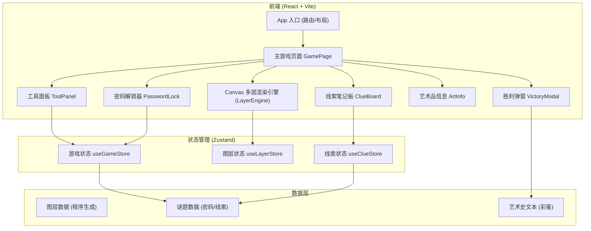

## 1. 架构设计



## 2. 技术选型

- **前端框架**: React 18 + TypeScript 5
- **构建工具**: Vite 5
- **样式方案**: Tailwind CSS 3 + CSS Variables (主题色)
- **状态管理**: Zustand (轻量 store)
- **渲染引擎**: HTML5 Canvas API (2D Context + 多 Canvas 叠加)
- **图标**: lucide-react
- **字体**: Google Fonts (Cinzel Decorative, Cormorant Garamond, Homemade Apple)

## 3. 图层设计 (核心)

油画由 **6 层独立 Canvas** 叠加构成，每层独立渲染，通过 globalCompositeOperation 混合：

| 层级 | 名称 | z-index | 初始可见性 | 混合模式 | 内容描述 |
|------|------|---------|-----------|----------|----------|
| Layer 0 | Varnish 清漆层 | 0 | 可见 | source-over | 表层油画：圣母与圣婴文艺复兴风格，带油画颜料肌理 |
| Layer 1 | UV Reveal 紫外层 | 1 | 隐藏 | screen | 用荧光颜料绘制的异端符号：倒十字、五角星、数字密文，紫外灯激活时显示紫色辉光 |
| Layer 2 | IR Underdrawing 红外层 | 2 | 隐藏 | multiply | 碳质底稿：精细的素描线条、透视辅助线、几何网格点（消失点坐标为密码关键） |
| Layer 3 | Star Map 星图层 | 3 | 隐藏 | difference | 星图连线，4 颗关键星的坐标与 IR 层透视点交叉 |
| Layer 4 | Solvent Reveal 溶剂层 | 4 | 隐藏 | source-over | 清漆下的签名 "Alchemista MDXXV" + 四元素符号 |
| Layer 5 | Scan Glow 扫描光效层 | 5 | 动态 | screen | 跟随鼠标的圆形辉光光斑，紫外线/红外线/溶剂各自颜色 |
| Layer 6 | Overlay 叠图层 | 6 | 动态 | difference/xor | 当启用叠图模式时，临时组合 Layer1+Layer2+Layer3 的差异 |

## 4. 密码谜题逻辑

最终密码为 **4 位数字**，推导过程：

```
第 1 位 = 紫外层倒十字符号数量 × 2
第 2 位 = 星图层"北交点星"的 x 坐标十位数 (IR层网格定位)
第 3 位 = 红外层透视消失点编号 (3号点 = 3)
第 4 位 = 溶剂层罗马数字 MDXXV 各位数之和 (1+0+2+5=8? 实际：M=1000取个位0 + D=500取个位0 + XX=20取个位0 + V=5 → 但谜题设计: MDXXV 中 X 出现 2 次，V 1 次，M D 各 1 → 字符种数 4)
```

预设正确答案：**2734**（可根据实际生成调整）

## 5. 核心组件结构

```
src/
├── components/
│   ├── canvas/
│   │   ├── LayerEngine.tsx        # Canvas 多层引擎 (主)
│   │   ├── PaintLayer.ts          # 各图层绘制函数
│   │   └── ScanEffect.ts          # 扫描光晕跟随
│   ├── ui/
│   │   ├── ToolPanel.tsx          # 左侧工具栏
│   │   ├── ClueBoard.tsx          # 右侧线索板
│   │   ├── PasswordLock.tsx       # 底部密码锁
│   │   ├── ArtInfoCard.tsx        # 艺术品信息卡
│   │   └── VictoryModal.tsx       # 胜利弹窗
│   └── layout/
│       └── GameLayout.tsx         # 整体三栏布局 + 木框装饰
├── store/
│   ├── gameStore.ts               # 游戏状态 (当前工具/进度/胜利)
│   ├── layerStore.ts              # 图层状态 (可见性/不透明度/混合)
│   └── clueStore.ts               # 线索收集
├── data/
│   ├── paintingData.ts            # 谜题配置、坐标、密码
│   └── artHistory.ts              # 艺术史文本彩蛋
├── hooks/
│   ├── useMouseTracker.ts         # 鼠标在 Canvas 内坐标
│   └── useClueDetection.ts        # 悬停区域线索检测
├── pages/
│   └── GamePage.tsx
└── App.tsx
```

## 6. 状态管理定义

### useGameStore
```typescript
type ToolType = 'none' | 'uv' | 'ir' | 'solvent' | 'stack' | 'grid';
type GameState = {
  currentTool: ToolType;
  solventProgress: number;         // 0~100 溶剂溶解进度
  discoveredClues: ClueId[];
  passwordInput: [string, string, string, string];
  isVictory: boolean;
  attempts: number;
  setTool: (t: ToolType) => void;
  applySolvent: (amount: number) => void;
  addClue: (id: ClueId) => void;
  setPasswordDigit: (i: number, v: string) => void;
  checkPassword: () => boolean;
};
```

### useLayerStore
```typescript
type LayerState = {
  layers: Record<LayerId, { visible: boolean; opacity: number; blend: GlobalCompositeOperation }>;
  scanPosition: { x: number; y: number } | null;
  setLayerVisible: (id: LayerId, v: boolean) => void;
  setLayerOpacity: (id: LayerId, o: number) => void;
  setScanPos: (p: { x: number; y: number } | null) => void;
};
```

## 7. Canvas 渲染循环

1. requestAnimationFrame 每帧清空所有 Canvas
2. 按 z-index 顺序渲染每层：
   - Layer0: 永远全量渲染油画
   - Layer1-4: 根据状态和工具决定渲染区域 (全局 or 仅扫描光斑范围)
   - Layer5: 跟随鼠标的径向渐变光斑，颜色随当前工具变化
   - Layer6: 叠图模式时，读取 Layer1/2/3 的像素做 difference
3. 线索检测：每帧根据鼠标位置查询数据中预设的 Clue Hotspot 区域，触发则调用 addClue

## 8. 数据初始化策略

所有图层**不使用外部图片资源**，全部用 Canvas API 程序化绘制：
- 油画层：多层几何图形 + 渐变 + 噪点肌理模拟文艺复兴油画质感
- 符号层：用 path + stroke 绘制几何符号
- 素描层：细线条 + 低透明度模拟碳稿
- 星图层：圆点 + 连线
- 这保证项目可离线运行且体积小
