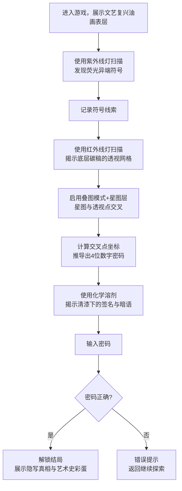

## 1. 产品概述

一款艺术史考究向解谜游戏，玩家扮演博物馆画作修复师，运用紫外线、红外线扫描和化学溶剂等专业工具，层层揭开一幅文艺复兴时期油画的秘密，通过叠合多层隐藏图像推导出隐写密码。

- 目标用户：解谜游戏爱好者、艺术史爱好者、文化探索者
- 核心价值：寓教于乐，在解谜过程中了解真实的油画修复技术与文艺复兴艺术史

## 2. 核心功能

### 2.1 用户角色
| 角色 | 描述 | 核心权限 |
|------|------|----------|
| 画作修复师 | 玩家扮演 | 操作工具、查看图层、推导密码、提交答案 |

### 2.2 功能模块
1. **主游戏画布**：多层 Canvas 叠加渲染，支持混合模式切换
2. **工具面板**：紫外线灯、红外线灯、化学溶剂、叠图模式、透视网格
3. **线索笔记板**：记录已发现的符号、星图位置、坐标数据
4. **密码解锁器**：4 位密码输入，验证答案
5. **艺术品信息卡**：画作背景故事、艺术家资料、修复日志

### 2.3 页面详情
| 页面名称 | 模块名称 | 功能描述 |
|----------|----------|----------|
| 主游戏页 | 画布区域 | 多层 Canvas 渲染油画，支持缩放、平移、鼠标悬停检测线索 |
| 主游戏页 | 左侧工具栏 | 6 种专业修复工具切换，带激活状态指示 |
| 主游戏页 | 右侧线索板 | 可折叠的笔记面板，自动/手动记录发现的线索 |
| 主游戏页 | 底部密码锁 | 4 位转轮密码输入，解锁按钮 |
| 主游戏页 | 顶部信息栏 | 画作标题、进度指示、提示按钮 |
| 胜利弹窗 | 结局展示 | 密码正确后显示隐藏的真相、艺术史彩蛋、通关动画 |

## 3. 核心流程

## 4. 用户界面设计

### 4.1 设计风格
- **主色调**：深胡桃木棕 #3E2723 基底，暖金色 #B8860B 点缀，羊皮纸米黄 #F5E6C8 背景
- **辅色调**：紫外紫 #9C27B0 辉光、红外红 #E53935 辉光、溶剂绿 #4CAF50 溶解效果
- **按钮风格**：仿黄铜金属质感，浮雕效果，悬停时微亮发光
- **字体**：标题用 Cinzel Decorative（古罗马石刻衬线），正文用 Cormorant Garamond（古典印刷衬线）
- **布局**：中央画布 + 左右工具/信息面板的经典博物馆工作台布局
- **装饰元素**：古董木框、牛皮纸纹理、磨损边缘、铜制铭牌、羽毛笔图标

### 4.2 页面设计概述
| 模块 | 关键元素 |
|------|----------|
| 画布外框 | 宽 80px 的深胡桃木木纹边框，四角有黄铜雕花装饰，内圈嵌 4px 金色内框 |
| 工具栏 | 竖向排布，每个工具是直径 60px 的圆形黄铜按钮，带微浮雕效果 |
| 线索板 | 仿羊皮纸卷效果，顶部有撕裂毛边，用手写体记录线索 |
| 密码锁 | 仿古董保险箱转盘，4 个同轴数字轮，黄铜质感 |
| 全局效果 | 整体覆一层细腻的胶片颗粒噪点，角落有暗角 vignette |

### 4.3 响应式设计
- 桌面端优先（1280px+）：经典三栏布局
- 平板端（768-1279px）：工具栏改为顶部横排，线索板改为底部抽屉
- 移动端（<768px）：单栏画布优先，工具浮动按钮，线索板全屏模态

### 4.4 Canvas 视觉效果指导
- **光照系统**：所有扫描工具带实时辉光光晕，跟随鼠标移动
- **混合模式**：
  - 紫外线：screen + 紫色色调映射 + 阈值高亮荧光区域
  - 红外线：multiply + 红色通道增强 + 碳稿细节锐化
  - 溶剂：destination-out + 噪点溶解动画，逐步侵蚀表层
  - 叠图：difference / xor 混合，突出图层差异即交叉线索
- **动画过渡**：图层切换时 opacity 渐变 300ms ease-in-out
